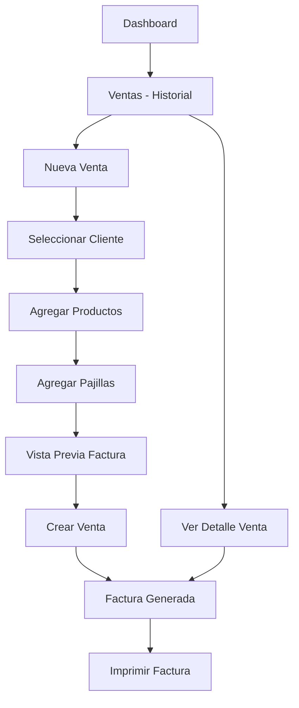

# Página de Ventas — ASOVARGAS

Crear una sección completa de **Ventas** que permita registrar ventas a clientes, añadir productos y pajillas, generar una factura imprimible con firmas, y consultar el historial de compras.

## Análisis de Base de Datos

La base de datos ya tiene las tablas necesarias:

| Tabla | Propósito |
|-------|-----------|
| `clients` | Clientes (asociados y compradores) con `client_id`, `name`, `document`, `phone`, `address`, etc. |
| `products` | Productos con `id`, `name`, `company`, `sale_price`, `quantity` (stock) |
| `pajillas` | Pajillas con `id`, `bull_name`, `company`, `breed`, `sale_price`, `quantity` |
| `buys` | Ventas/Compras: `id`, `client_id`, `buy_number`, `total_amount`, `created_at` |
| `buy_items` | Items de la venta: `id`, `buy_id`, `product_id`, `quantity`, `unit_price`, `total_price` |

> [!IMPORTANT]
> La tabla `buy_items` ya tiene triggers para descontar stock automáticamente de `products`. Sin embargo, **no hay soporte para pajillas en `buy_items`**. Se necesita crear una tabla `buy_pajilla_items` o extender la existente.

## User Review Required

> [!WARNING]
> **Pajillas en ventas**: La tabla `buy_items` solo referencia `products`. Para vender pajillas necesitamos una tabla adicional `buy_pajilla_items` con triggers similares para descontar stock de pajillas. 
> ¿Estás de acuerdo con este enfoque?

> [!IMPORTANT]
> **Actualización del total de `buys`**: Actualmente no hay un trigger que actualice `total_amount` en `buys` al insertar `buy_items` (a diferencia de `orders`/`order_items` que sí lo tienen). Se creará un trigger similar para `buys`.

## Proposed Changes

### 1. Base de Datos (SQL)

#### [NEW] [scripts/03-create-ventas.sql](file:///c:/Users/diegu/OneDrive/Documents/software/enterprises/asovargas/scripts/03-create-ventas.sql)

- Crear tabla `buy_pajilla_items` (similar a `buy_items` pero con referencia a `pajillas`)
- Trigger para descontar stock de `pajillas` al insertar/actualizar/eliminar items
- Trigger para actualizar `total_amount` en `buys` al modificar `buy_items` o `buy_pajilla_items`
- Índices necesarios para performance

---

### 2. Tipos TypeScript

#### [MODIFY] [types.ts](file:///c:/Users/diegu/OneDrive/Documents/software/enterprises/asovargas/lib/types.ts)

- Añadir interfaces: `Buy`, `BuyItem`, `BuyPajillaItem`, `BuyWithItems`

---

### 3. Página de Ventas (listado + historial)

#### [NEW] [app/dashboard/ventas/page.tsx](file:///c:/Users/diegu/OneDrive/Documents/software/enterprises/asovargas/app/dashboard/ventas/page.tsx)

- Página principal con listado de ventas realizadas (historial)
- Botón "Nueva Venta"
- Skeleton loading

#### [NEW] [components/ventas/ventas-list.tsx](file:///c:/Users/diegu/OneDrive/Documents/software/enterprises/asovargas/components/ventas/ventas-list.tsx)

- Componente server-side que lista todas las ventas con:
  - Número de venta, cliente, total, fecha
  - Botón para ver detalles / factura
  - Búsqueda por nombre de cliente

---

### 4. Formulario de Nueva Venta

#### [NEW] [app/dashboard/ventas/nueva/page.tsx](file:///c:/Users/diegu/OneDrive/Documents/software/enterprises/asovargas/app/dashboard/ventas/nueva/page.tsx)

- Wrapper que renderiza el formulario de venta

#### [NEW] [components/ventas/venta-form.tsx](file:///c:/Users/diegu/OneDrive/Documents/software/enterprises/asovargas/components/ventas/venta-form.tsx)

Formulario completo con:
1. **Selección de Cliente** — Select consultando la tabla `clients` 
2. **Sección Productos** — Añadir productos del inventario con cantidad y precio
3. **Sección Pajillas** — Añadir pajillas del inventario con cantidad y precio
4. **Resumen / Factura en Tiempo Real** — Preview de la factura con:
   - Información del cliente (nombre, documento, dirección, teléfono)
   - Lista desglosada de productos y pajillas
   - Subtotales y total
   - Espacio para **Firma Vendedor** y **Firma Comprador**
5. **Botones: Crear Venta / Imprimir Factura**

---

### 5. Detalle de Venta / Factura

#### [NEW] [app/dashboard/ventas/[id]/page.tsx](file:///c:/Users/diegu/OneDrive/Documents/software/enterprises/asovargas/app/dashboard/ventas/%5Bid%5D/page.tsx)

- Page que carga la venta completa con items

#### [NEW] [components/ventas/venta-invoice.tsx](file:///c:/Users/diegu/OneDrive/Documents/software/enterprises/asovargas/components/ventas/venta-invoice.tsx)

- Componente de factura imprimible con:
  - Header con logo/nombre de la empresa
  - Datos del cliente
  - Tabla de productos y pajillas
  - Total
  - Líneas de firma (vendedor y comprador)
  - Botón de imprimir (`window.print()`)
  - Estilos `@media print` para ocultar la UI del dashboard al imprimir

---

### 6. Navegación

#### [MODIFY] [dashboard-header.tsx](file:///c:/Users/diegu/OneDrive/Documents/software/enterprises/asovargas/components/dashboard-header.tsx)

- Añadir link a "Ventas" en la navegación desktop

#### [MODIFY] [mobile-nav.tsx](file:///c:/Users/diegu/OneDrive/Documents/software/enterprises/asovargas/components/mobile-nav.tsx)

- Añadir link a "Ventas" en la navegación mobile

---

## Flujo de Usuario

## Open Questions

> [!IMPORTANT]
> 1. ¿El nombre de la empresa en la factura debe ser siempre "ASOVARGAS" o puede variar?
> 2. ¿Se necesita NIT u otra información fiscal en la factura?
> 3. ¿Las pajillas deben poder venderse en la misma factura que los productos, o prefieres tener ventas separadas?

## Verification Plan

### Automated Tests
- Verificar que la app compila sin errores con `pnpm build`
- Navegación correcta entre las páginas

### Manual Verification
- Abrir la app en el navegador y verificar:
  - Navegación a `/dashboard/ventas`
  - Crear una nueva venta seleccionando cliente, productos y pajillas
  - Visualizar la factura con firmas
  - Imprimir la factura
  - Ver el historial de ventas
